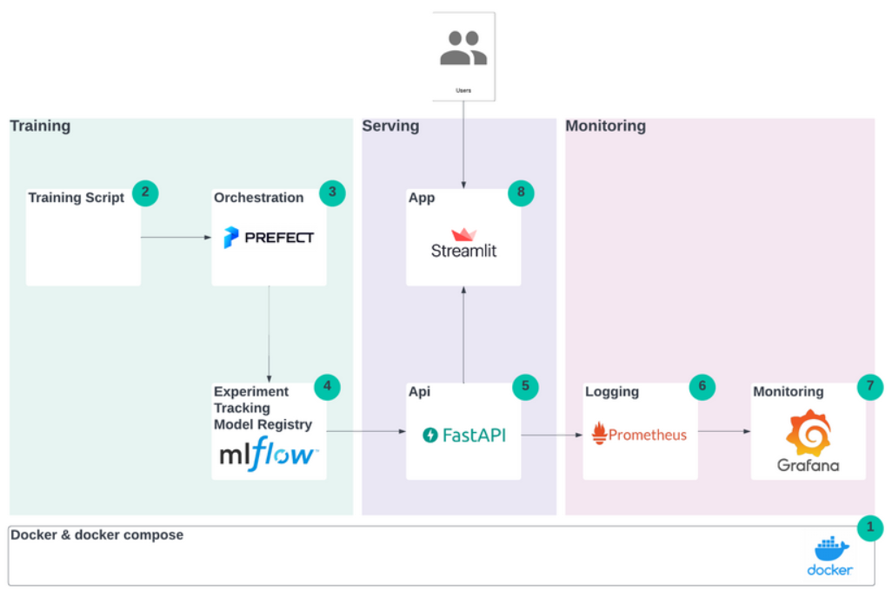
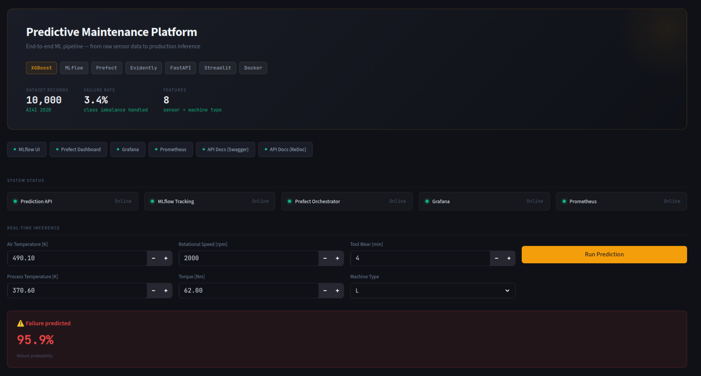

# PredMaint ML Platform

End-to-end MLOps platform for predictive maintenance.
This project covers the full lifecycle: data ingestion, feature engineering, model training, experiment tracking, API serving, monitoring, drift detection, and retraining orchestration.



---

## Recruiter Overview

This repository is built to demonstrate real-world MLOps execution, not just notebook experimentation.

### What this project proves

- I can design, implement, and operate a production-style ML system end to end.
- I can ship reliable APIs with observability and operational safeguards.
- I can apply CI/CD discipline with automated quality gates.
- I can adapt architecture pragmatically based on cost constraints.

### Key capabilities demonstrated

- **Model lifecycle:** training, evaluation, artifact management, and reproducible runs.
- **Serving:** FastAPI inference service with health checks and cloud/local model path support.
- **Monitoring:** custom Prometheus metrics + Grafana dashboards for API and model behavior.
- **Drift workflow:** Evidently-based drift checks integrated into monitoring pipeline.
- **Orchestration:** Prefect flows for training and monitoring logic.
- **Engineering quality:** linting, strict typing, tests, and secure CI conventions.

---

## Architecture At A Glance

```text
CI/CD (GitHub Actions)
  -> lint + typecheck + tests
  -> Docker image build and push
  -> ECS task definition update + service deploy

Inference API (FastAPI)
  -> /predict
  -> /health
  -> /metrics
  -> model loaded from local file or S3 URI

ML workflows
  -> data pipeline
  -> training pipeline + MLflow logging
  -> drift detection pipeline (Evidently)
  -> optional auto-retraining trigger

Observability
  -> Prometheus scrapes API metrics
  -> Grafana visualizes service and model signals
```

---

## Deployment Strategy (AWS First, Local After Free Tier)

This project was initially deployed in AWS with a production-oriented setup:

- API container on **AWS ECS Fargate**
- image registry in **Amazon ECR**
- model artifact support via **Amazon S3** (`MODEL_PATH=s3://...`)

After the AWS Free Tier period, I run the complete stack locally to keep costs sustainable.
I cannot justify ongoing cloud expenses for a portfolio project at this stage, so the platform is designed to keep the same core behavior in local mode.

Local mode still includes:

- FastAPI API
- Streamlit dashboard
- MLflow UI
- Prefect UI
- Evidently drift job
- Prometheus + Grafana

This approach keeps the project realistic, maintainable, and fully demonstrable to recruiters.

---

## Tech Stack

- Python 3.12
- FastAPI + Uvicorn
- XGBoost + scikit-learn + pandas
- Prefect
- MLflow
- Evidently
- Prometheus + Grafana
- Docker + Docker Compose
- AWS ECS Fargate + ECR + S3

---

## Run Locally (Full Platform)

### Prerequisites

- Docker + Docker Compose
- Dataset at `data/raw/ai4i2020.csv`

### Start everything

```bash
docker compose up -d --build
```

### Service URLs

- API: `http://localhost:8000`
- Swagger: `http://localhost:8000/docs`
- Streamlit: `http://localhost:8501`
- MLflow: `http://localhost:5000`
- Prefect: `http://localhost:4200`
- Prometheus: `http://localhost:9090`
- Grafana: `http://localhost:3000`

### Stop

```bash
docker compose down
```

---

## Model Performance (Current Baseline)

Binary failure prediction on AI4I 2020 predictive maintenance data:

- ROC-AUC: 0.974
- F1: 0.711
- Recall: 0.779
- Precision: 0.654

The model is tuned to prioritize recall due to the operational cost of missed failures.

---

## Repository Structure

```text
src/
  api/                FastAPI inference service
  core/               business logic and feature engineering
  pipelines/          data, training, and monitoring flows
  monitoring/drift/   Evidently drift detection
  dashboard/          Streamlit UI
configs/
  prometheus.yml
  grafana/
tests/
Dockerfile.api
docker-compose.yml
ecs-task.json
```

---

## Author

Valentin Rubio

- LinkedIn: <https://www.linkedin.com/in/rubiovalentin>
- GitHub: <https://github.com/valerubio7>
